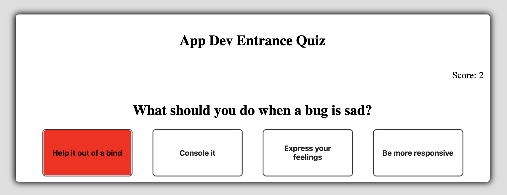

# App Developer Entrance Project

A client-side quiz app based on the provided JSON file.

Only HTML / CSS / Javascript were used while building this project.

## Summary

A quiz app that uses data from a local JSON file via the JavaScript fetch api.

The app tests the users selected answers and compares them to the quiz data.

Quiz data can be found in [src/quiz.json](./src/quiz.json). This content will be loaded when a user starts a quiz.

For every question there is one correct answer (with a value of `true`) and three incorrect answers with a value of `false`. The `content` field contains a possible answer.

```js
{
  quizzes: [{
    title: 'Quiz 1',
    questions: [{
      question: 'Question 1?'
      answers: [{
        content: 'Answer 1.',
        value: false // wrong answer
      }, {
        content: 'Answer 2.',
        value: true // correct answer
      }]
    }]
  }]
}
```


